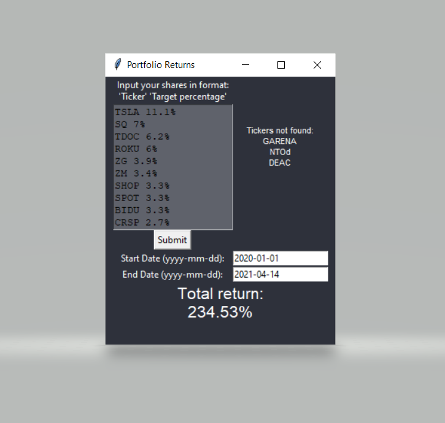

## About The Project

This is a Python app for calculating the returns of a stock portfolio over a chosen period of time. It was designed to work with the input of portfolio stocks formatted in the same way as it is produced by my other project, the [Trading212 Chrome extension](https://github.com/lukas-ostrovskis/chrome-extension-trading212.git).



## Installation

1. Clone the repo:
   ```sh
   git clone https://github.com/lukas-ostrovskis/stock-portfolio-return-calculator.git
   ```
2. Run `pip install yfinance` to add the Yahoo! Finance library.

## Usage

1. Run `python app.py` or run the executable `/dist/app.exe`.
2. Input the portfolio with share entries as described.
3. Choose the start and end dates for the time frame in which portfolio returns should be calculated.
4. Click submit and wait for the program to calculate the returns*.<br>
*It might take a while for the program to fetch data of all stocks (e.g. calculation for 50 stocks can take up to 1 min).
5. Some of the stock tickers might not be found by the library, it will list all the tickers for which it is the case. If this happens, keep in mind that the total return won't be totally accurate as the program doesn't adjust portfolio targets and simply ignores unknown tickers, making the sum of targets < 100%.